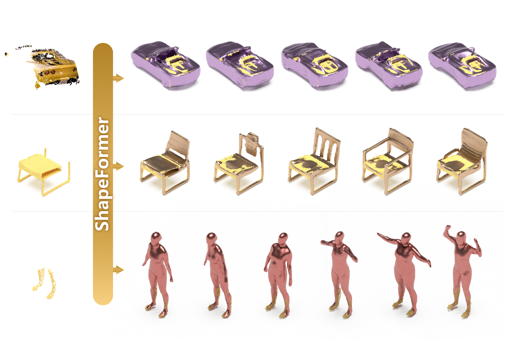

**This repository is just a pytorch implementation of the paper *ShapeFormer: Transformer-based Shape Completion via Sparse Representation*.**

## Installation

    git clone --recursive https://github.com/QhelDIV/ShapeFormer.git
    conda env create -f environment.yaml
    conda activate shapeformer

    pip install torch-scatter==2.0.7 -f https://data.pyg.org/whl/torch-1.7.0+cu101.html

## Demo

    python -m shapeformer.trainer --opts configs/demo/demo_vqdif.yaml --gpu 0 --mode "run"

Run the following command to test ShapeFormer for shape completion. The results are in `experiments/demo_shapeformer/results`

    python -m shapeformer.trainer --opts configs/demo/demo_shapeformer.yaml --gpu 0 --mode "run"

## Dataset

We use the dataset from [IMNet](https://github.com/czq142857/IM-NET#datasets-and-pre-trained-weights), which is obtained from [HSP](https://github.com/chaene/hsp).

The dataset we adopted is a downsampled version (64^3) from these dataset (which is 256 resolution).
Please download our processed dataset from this google drive [URL](https://drive.google.com/file/d/1HUbI45KmXCDJv-YVYxRj-oSPCp0D0xLh/view?usp=sharing).
And then extract the data to `datasets/IMNet2_64/`.

To use the full resolution dataset, please first download the original IMNet and HSP datasets, and run the `make_imnet_dataset` function in `shapeformer/data/imnet_datasets/imnet_datasets.py`

### D-FAUST Human Dataset
We also provide the scripts for process the D-FAUST human shapes. 
First, download the official D-FAUST dataset from this [link](https://dfaust.is.tuebingen.mpg.de/download.php) and extract to `datasets/DFAUST`
Then, execute the following lines to generate obj files and generate sdf samples for the human meshes.

    cd shapeformer/data/dfaust_datasets/datagen
    python generate_dfaust_obj_runfile.py
    bash generate_dfaust_obj_all.sh
    python generate_dfaust_sdf_samples.py

## Usage

First, train VQDIF-16 with 

    python -m shapeformer.trainer --opts configs/vqdif/shapenet_res16.yaml --gpu 0

After VQDIF is trained, train ShapeFormer with

    python -m shapeformer.trainer --opts configs/shapeformer/shapenet_scale.yaml --gpu 0

For testing, you just need to append `--mode test` to the above commands.
And if you only want to run callbacks (such as visualization/generation), set the mode to `run`
